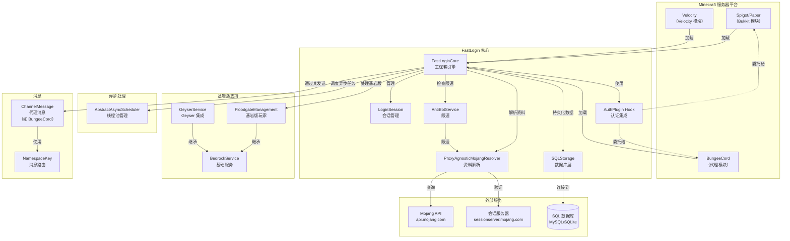

# 贡献指南

## 架构概览

```mermaid
graph TB
    subgraph "Minecraft 服务器平台"
        SPIGOT["Spigot/Paper<br/>（Bukkit 模块）"]
        BUNGEE["BungeeCord<br/>（代理模块）"]
        VELOCITY["Velocity<br/>（Velocity 模块）"]
    end

    subgraph "FastLogin 核心"
        CORE["FastLoginCore<br/>主逻辑引擎"]
        SESSION["LoginSession<br/>会话管理"]
        AUTH["AuthPlugin Hook<br/>认证集成"]
        RESOLVER["ProxyAgnosticMojangResolver<br/>资料解析"]
        STORAGE["SQLStorage<br/>数据库层"]
        ANTIBOT["AntiBotService<br/>限速"]
    end

    subgraph "基岩版支持"
        FLOODGATE["FloodgateManagement<br/>基岩版玩家"]
        GEYSER["GeyserService<br/>Geyser 集成"]
        BEDROCK["BedrockService<br/>基础服务"]
    end

    subgraph "外部服务"
        MOJANG["Mojang API<br/>api.mojang.com"]
        SESSION_SERVER["会话服务器<br/>sessionserver.mojang.com"]
        DATABASE[(SQL 数据库<br/>MySQL/SQLite)]
    end

    subgraph "异步处理"
        SCHEDULER["AbstractAsyncScheduler<br/>线程池管理"]
    end

    subgraph "消息"
        MESSAGES["ChannelMessage<br/>代理消息<br/>（如 BungeeCord）"]
        NAMEKEY["NamespaceKey<br/>消息路由"]
    end

    SPIGOT -->|加载| CORE
    BUNGEE -->|加载| CORE
    VELOCITY -->|加载| CORE

    CORE -->|管理| SESSION
    CORE -->|使用| AUTH
    CORE -->|解析资料| RESOLVER
    CORE -->|持久化数据| STORAGE
    CORE -->|检查限速| ANTIBOT
    CORE -->|处理基岩版| FLOODGATE

    FLOODGATE -->|继承| BEDROCK
    GEYSER -->|继承| BEDROCK

    RESOLVER -->|查询| MOJANG
    RESOLVER -->|验证| SESSION_SERVER

    STORAGE -->|连接到| DATABASE

    CORE -->|调度异步任务| SCHEDULER

    MESSAGES -->|使用| NAMEKEY
    CORE -->|通过其发送| MESSAGES

    AUTH -.->|委托给| SPIGOT
    AUTH -.->|委托给| BUNGEE

    ANTIBOT -->|限速| RESOLVER
```
