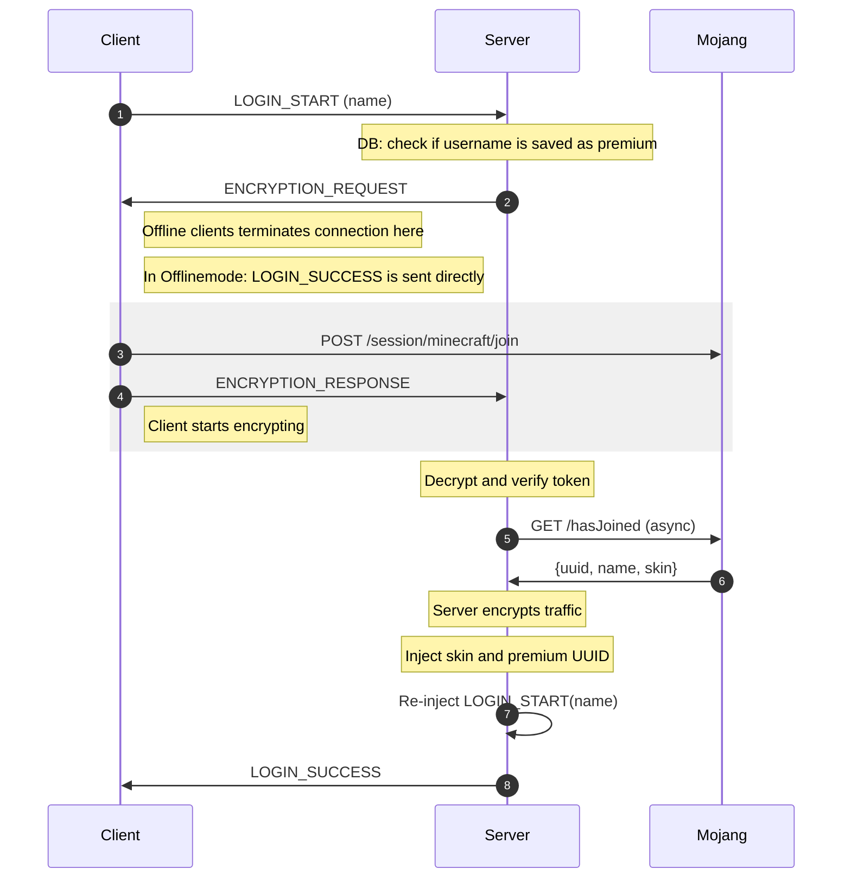

# FastLogin

检查玩家是否拥有正版Minecraft账户（Premium）。如果是，则可以跳过离线认证（登录插件）。因此他们无需输入密码。这也称为自动登录（auto-login）。

## 功能

* 识别正版账户
* 自动登录正版账户（Premium）
* 支持多种验证插件
* 正版 UUID 支持
* 同步皮肤
* 检测用户名变更并更新数据库记录
* 支持 BungeeCord/Velocity
* 自动注册新正版玩家
* 无需客户端修改
* 异步操作保证高性能
* 多语言支持
* 支持通过 Floodgate 接入的基岩版玩家

## 问题反馈

请使用issue提交错误报告、建议、疑问等。提交前请检查是否已有相同问题。您可以通过在原帖添加👍支持已有issue。关闭issue仅表示标记为已解决，仍可评论并重新开启。

## 开发版本

开发版本包含最新的源代码变更，属于前沿版本，可能存在新bug，但也包含未发布版本的新功能、优化和修复。点击左侧的`Changes`可查看具体构建的变更日志。

下载地址：https://github.com/Chenyu550/FastLogin/releases

***

## Technical Authentication

## 命令

    /premium [玩家] 将自己或指定玩家标记为正版账户
    /cracked [玩家] 将自己或指定玩家标记为离线账户

## 权限

    fastlogin.bukkit.command.premium （标记自己或指定玩家为正版账户）
    fastlogin.bukkit.command.cracked （标记自己或指定玩家为离线账户）

    fastlogin.command.premium.other （标记其他玩家为正版账户）
    fastlogin.command.cracked.other （标记其他玩家为离线账户）

## 占位符

本插件支持Spigot的`PlaceholderAPI`，提供以下变量：
`%fastlogin_status%`。在BungeeCord环境下，玩家状态会在成功加入服务器后延迟约数毫秒更新，此时变量值为`Unknown`。

可能值：`Premium`（正版），`Cracked`（离线），`Unknown`（未知）

## 要求

* Java：推荐21+（FastLogin优化了多线程代码）
  * Spigot：8+
  * BungeeCord和Velocity：17+
* 服务器需开启离线模式：
  * Spigot（或分支如Paper）1.8.8+
    * 需协议插件：
      * [ProtocolLib 5.3+（开发版需高于720）](https://www.spigotmc.org/resources/protocollib.1997/) 或
      * [ProtocolSupport](https://www.spigotmc.org/resources/protocolsupport.7201/)
  * 最新版BungeeCord（或分支如Waterfall）或Velocity代理
* 需安装验证插件

### 支持的验证插件

#### Spigot/Paper

* [AdvancedLogin (付费)](https://www.spigotmc.org/resources/advancedlogin.10510/)
* [AuthMe (5.X)](https://dev.bukkit.org/bukkit-plugins/authme-reloaded/)
* [CrazyLogin](https://dev.bukkit.org/bukkit-plugins/crazylogin/)
* [LoginSecurity](https://dev.bukkit.org/bukkit-plugins/loginsecurity/)
* [LogIt](https://github.com/games647/LogIt)
* [UltraAuth](https://dev.bukkit.org/bukkit-plugins/ultraauth-aa/)
* [UserLogin](https://www.spigotmc.org/resources/userlogin.80669/)
* [xAuth](https://dev.bukkit.org/bukkit-plugins/xauth/)

#### BungeeCord/Waterfall

* [BungeeAuth](https://www.spigotmc.org/resources/bungeeauth.493/)

## 网络请求

本插件会请求以下地址：

* https://api.mojang.com - 获取UUID数据以判断是否启用正版登录
* https://sessionserver.mojang.com - 验证玩家是否为账户所有者

***

## 安装指南

### Spigot/Paper

1. 下载安装ProtocolLib/ProtocolSupport
2. 下载安装`FastLoginBukkit`
3. 在server.properties中将`onlinemode`设为`false`（离线模式）

### BungeeCord/Waterfall或Velocity

插件需同时安装在代理（BungeeCord或Velocity）和后端服务器（Spigot）上。

1. 在后端服务器配置中启用代理支持
   * 通常在`spigot.yml`或`paper.yml`中设置
2. 重启后端服务器
3. 在FastLogin目录生成`allowed-proxies.txt`
    * BungeeCord：将BungeeCord配置中的`stats`-id填入该文件
    * Velocity：插件启动时会在代理插件目录生成`proxyId.txt`
4. 在代理配置中启用IP转发
5. 检查代理端FastLogin配置的数据库设置
    * 代理端仅支持有限数据库驱动：
    * BungeeCord：`mysql`（MySQL/MariaDB）
    * Velocity：`mariadb`（MySQL/MariaDB）
    * 注意：不支持嵌入式SQLite
    * MySQL/MariaDB需外部数据库服务，请咨询服务器提供商或自行搭建
6. 在代理和Spigot的配置中将`onlinemode`设为`false`
7. *务必*通过防火墙限制Spigot服务器只能通过代理访问
   * 即使不使用本插件也应如此配置
   * 参考：https://www.spigotmc.org/wiki/bungeecord-installation/#post-installation
